# Time-Series-Theory

# Trend - tính xu hướng
Trend thể hiện xu hướng thay đổi của dữ liệu theo thời gian, ví dụ giá nhà tăng theo từng năm...

Tính chu kỳ: tính chất lặp lại của dữ liệu theo thời gian.

Tính thời vụ

Nhiễu: thể hiện tính chất không dự đoán trước được của dữ liệu

# Moving average and diferencing
Một cách dự đoán đơn giản là tính `moving average`. Ví dụ gia trị tiếp theo bằng trung bình của 30 ngày trước đó. Cách này loại bỏ rất nhiều nhiễu, nó không dự đoán được xu hướng và tính thời vụ. 

Một cách để tránh được điều này là loại bỏ `trend` và `seasonality` khỏi time series với kỹ thuật `differecing`. Chúng ta sẽ nghiên cứu sự khác nhau giữa giá trị tại thời điểm `t` và giá trị tại thời điểm trước đó (tùy thuộc trường hợp là ngày, tháng, năm...), khi đó chúng ta không có trend và cả seasonality. Sau đó sử dụng `moving average` để dự đoán giá trị cho time series này. Nên nhớ đây là dự đoán cho difference, muốn lấy giá trị thực tế cần cộng với giá trị tại thời điểm trước đó. Cuối cùng ta nhận được đường dự đoán có nhiều noise (noise này xuất hiện từ giá trị tại thời điểm trước đó từ time series ban đầu). Chúng ta có thể loại bỏ noise này bằng cách áp dụng `moving average` cho giá trị tại thời điểm trước.

# Week 2
Áp dụng một số kỹ thuật ML để dự đoán dữ liệu.
## Preparing features and labels
`Features` - một số giá trị liên tuc trong series (chúng ta gọi cái này là `window_size`, nhìn cũng như cái cửa số vậy) và `label` là giá trị tiếp theo.

Ví dụ chúng ta có thể lấy 30 giá trị liên tiếp là features và giá trị tiếp theo làm label. Sau đó sẽ dụng mạng NN để match 30 features đến single label.
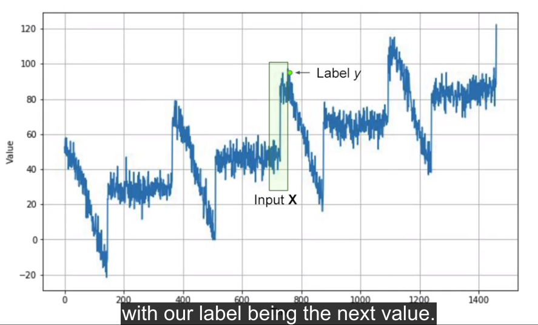

```python
dataset = tf.data.Dataset.range(10)
dataset = dataset.window(5, shift=1, drop_remainder=True)
dataset = dataset.flat_map(lambda window: window.batch(5))
dataset = dataset.map(lambda window: (window[:-1], window[-1:]))
dataset = dataset.shuffle(buffer_size=10)

# xem xét dữ liệu theo batch, ở đây lấy batch cho 2 dữ liệu 
dataset = dataset.batch(2).prefetch(1)
for x,y in dataset:
    print("x = ", x.numpy())
    print("y = ", y.numpy())

```
Lý do cần shuffle data do có `sequence bias`. Sequence bias is when the order of things can impact the selection of things (độ lệch (thiên vị chuỗi) - thứ tự của vật có thể ảnh hướng đến lựa chọn vật). For example, if I were to ask you your favorite TV show, and listed "Game of Thrones", "Killing Eve", "Travellers" and "Doctor Who" in that order, you're probably more likely to select 'Game of Thrones' as you are familiar with it, and it's the first thing you see. Even if it is equal to the other TV shows. So, when training data in a dataset, we don't want the sequence to impact the training in a similar way, so it's good to shuffle them up. 

## Single layer NN
Dự đoán dữ liệu sử dụng single layer NN (linear regression)

## Deep NN
Sử dụng NN với nhiều layers để dự đoán để có kết quả tốt hơn

Nhận thấy `sequence data` hoạt động tốt hơn với RNN.

# Week3
Áp dụng RNN, LSTM vào time series. Học cách dùng `Lambda layer`
Các giá trị gần thường sẽ có ảnh hưởng đến các giá kế tiếp, do đó một cách rất tự nhiên là áp dụng mô hình RNN vào dự đoán dữ liệu.
## RNN
RNN hay Recurrent Neural Network là mạng NN recurrent layer (gọi là recurrent vì ở mỗi cell nó lại đưa ra `ouput` để đưa vào cell tiếp theo). Nó hay được dùng để xử lý các dữ liệu có dạng chuỗi. RNN rất flexible, có thể xử lý được text, giọng nói, ở đây chúng ta sử dụng để xử lý data time series.

Với RNN chúng ta có thể truyền vào `batch of sequences` và đưa ra output là `batch of forecasts`, giống như những gì học được ở khóa NLP.

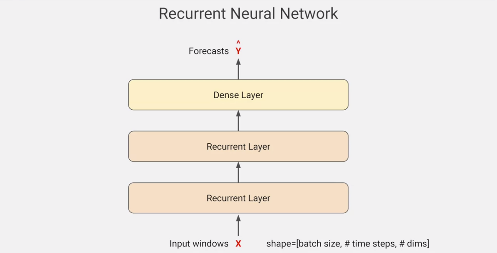
Tuy nhiên khi dùng RNN để xử lý dữ liệu time series input_shape có thay đổi thành `[batch_size, # time steps, # dims]`
(# dims - là dimensionality of the input at each time step). 
- Nếu là `univariate time series` **#dims = 1**
- Nếu là `multivariate` **#dims >=2** (theo dõi nhiều thông tin cùng một lúc)
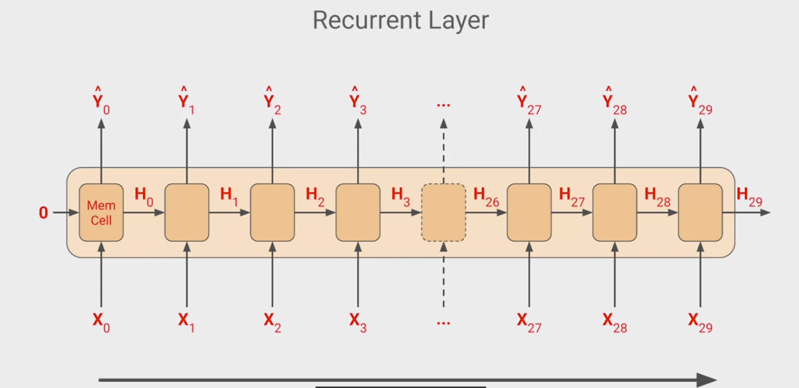

### Shape of the inputs to the RNN
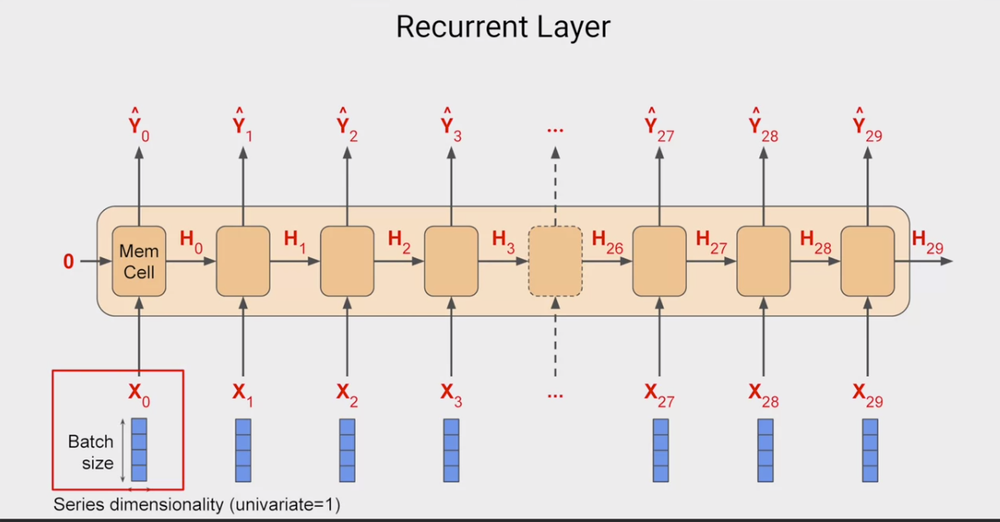
The inputs are 3-dimensional. Ví dụ có `window_size =30 timesteps`, có `batch_size=4` => input_shape=[4, 30, 1]. Tại mỗi time step, the `memory cell input` sẽ là ma trận `4x1` như hình trên. 

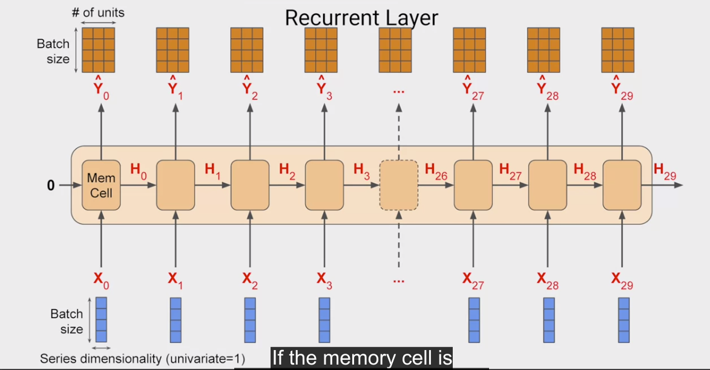
Nếu `memory cell` có 3 neurons, lúc đó output tại mỗi time step là `4x3` (4 là batch_size). The full output sẽ là matrix `4x30x3` (tính tất cả các cells).

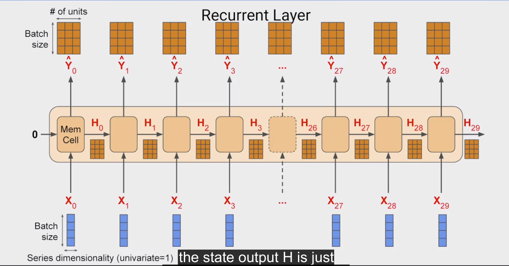
Đối với mạng RNN đơn giản state output H thường bằng chính output ở time step đó. Trong Keras sẽ gọi `SimpleRNN` Do đó ở mỗi cell đầu vào bao gồm current input và previous output. 

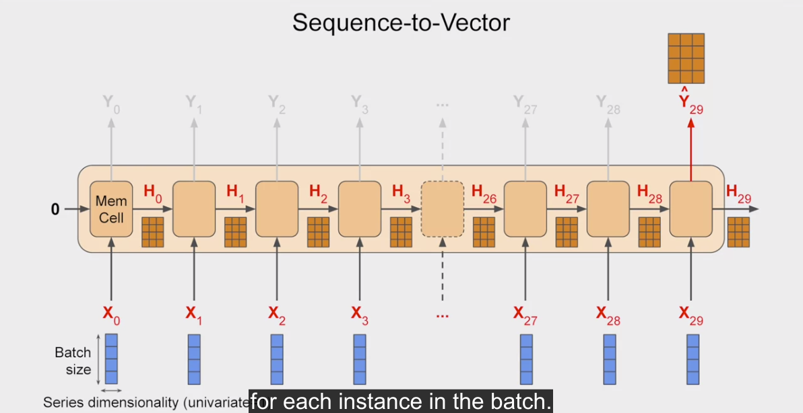
Đôi khi chúng ta chỉ muốn lấy output ở cell cuối, khi đó ta có dạng `sequence-to-vector`. Việc đơn giản để `return_sequence=False` - đây là chế độ mặc định trong Keras.

### Outputing a sequence
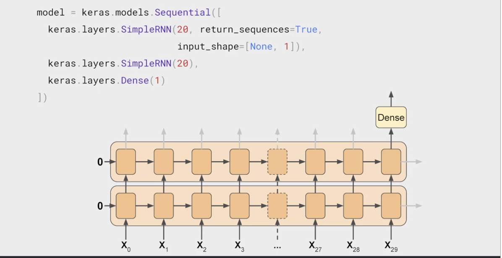
Mạng RNN có 2 recurrent layer và 1 Dense layer, Recurrent layer đầu tiên để `return_sequence=True` vì có recurrent layer thứ hai. Recurrent layer thứ 2 không có `return_sequence=True` do đó nó chỉ đưa ra output ở cell cuối cùng, cái này sẽ kết nối với Dense layer.

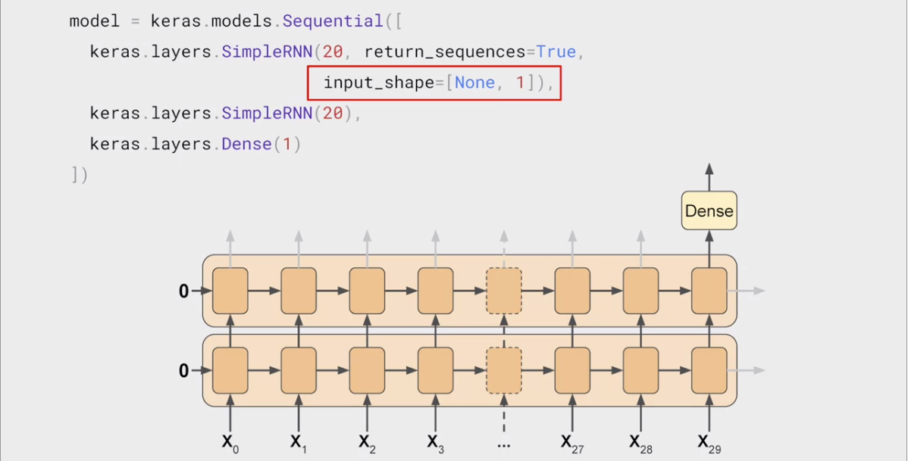
Chú ý đến `input_shape=[None, 1]` trên hình. TF cho dimension đầy tiên là `batch_size` có có thể có kích thước tùy ý, nên không cần biểu diễn vào đó. Dimension tiếp theo là `# time steps`, có thể đặt là `None` (như hình), điều này ám chỉ RNN có thể xử lý chuỗi với chiều dài bất kì. Dimension cuối cùng là 1 do ta đang sử dụng `univariate time series`. 

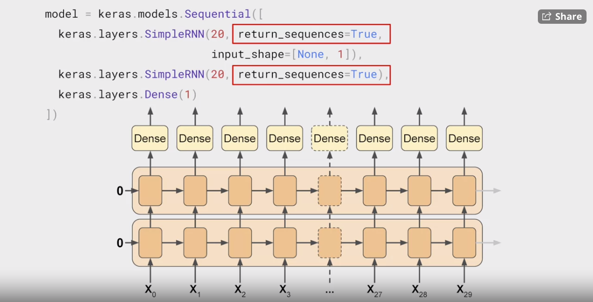
Nếu ở recurrent layer thứ 2 set `return_sequence=True` nó sẽ trả về sequence, do đó Dense layer sẽ nhận vào sequence như là input. Nên nhớ nếu batch_size = 1 (1 example) thì mỗi output là một vector, gộp tất cả vector lại ta sẽ có 2d array mà Dense layer ở dạng vector. Do vậy để xử lý điều này Keras sử dụng Dense layer cho mỗi outputở các step độc lập nhau. Cái này sẽ cho chúng ta `sequence-to-sequence RNN`, nó nhận vào batches of sequences và đưa ra batch of sequences cùng độ dài. 

`RNN layer` nếu để `return_sequence=True` nó sẽ trả về tất cả các output ở các cell. Điều này là cần thiết khi chúng ta muốn stack (đặt) `RNN layer` lên `RNN layer` trước đó. Trong bài toán giả sử có 3 layer gồm hai `RNN layer` và một Dense layer. Nếu `RNN layer` phía sau không đặt `return_sequence=True` nó sẽ chỉ trả về 1 output duy nhất ở cell cuối cùng, sau đó output này được connect với lớp Dense layer. Tuy nhiên nếu `RNN layer` phía sau có đặt `return_sequence=True` nó sẽ trả về tất cả output tại các cells. Do đó mỗi output này lại được kết nối với 1 Dense layer (các Dense layer này đọc lập). Thử chạy cái này xem có cho ra output là cái gì?

### Lambda layer
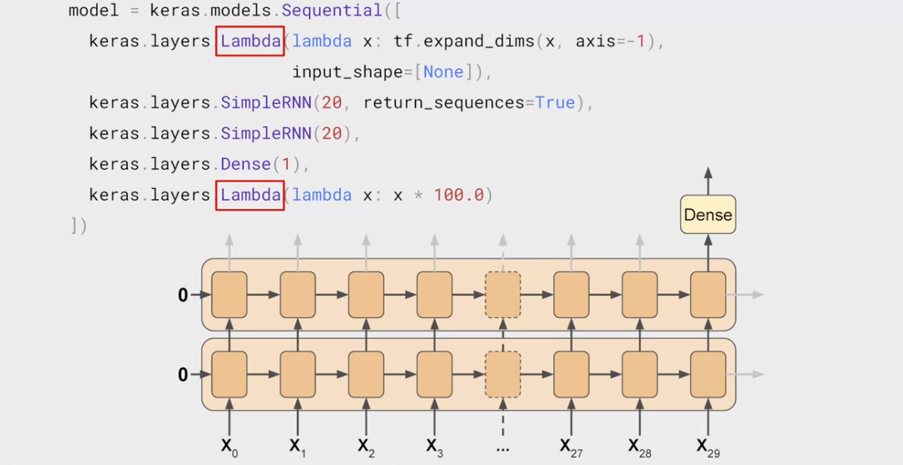
Ở đây có thêm 2 layers mới sử dụng `Lambda type`. `Lambda layer` giúp chúng ta thực hiện bất kì phép tính nào để mở rộng chức năng của Keras.
Lambda layer đầu tiên giúp chúng ta về dimensionality. Nhớ lại khi xây dựng dataset sử dụng `window` nó trả về cho chúng ta 2-dimensional batches (dimension đầu tiên là `batch_size`, dimension thứ hai là `# time steps`). Tuy nhiên RNN chờ đợi 3-dimensions `batch_size, # time steps, # dimensionality of series`. Với Lamda layer chúng ta có thể xử lý được việc này mà không cần sửa lại hàm tạo dataset. Sử dụng `Lamda layer` chúng ta mở rộng thêm dimension bằng cách set `input_shape=[None]` (2 dimensions, dimension đầu tiên là batch_size, dimension thứ 2 là # time steps, ở đây chấp nhận time step có chiều dài bất kì), điều này có nghĩa răng model có thể lấy sequences với độ dài bất kì. 

Tương tự `Lambda layer` ở cuối có thể giúp quá trình training. Do default activation function trong RNN là `tanh(x)` có giá trị trong khoảng (-1, 1). Tuy nhiên do output thường 30, 40, 50... lần lớn hơn

### Adjusting the learning rate dynamically

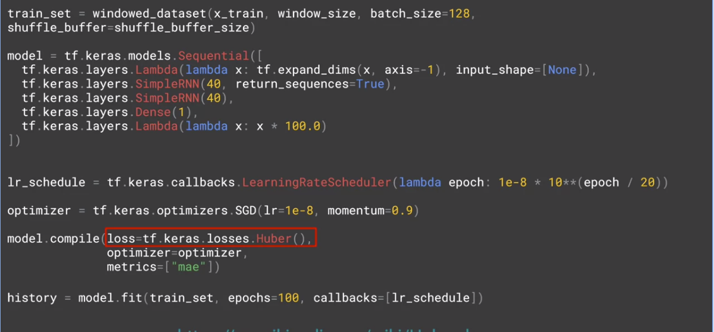
**Hube loss** - loss function hay được dùng trong regression, loss này ít nhạy với outliers (nhiễu) hơn là `Mean squred error`

Ở phía trên có sử dụng `LearningRateScheduler` để có thể tìm được `learning rate` hợp lý. Sau khi chạy tìm được `learning rate` ta sẽ thay lại learning rate mới vào và không dùng `LearningRateScheduler` nữa.

## LSTM
Bài trước dùng RNN để dự đoán dữ liệu time series, tuy nhiên nhận thấy vẫn có một đoạn plataeu. Bài này sẽ áp dụng LSTM vào để dự đoán dữ liệu time series. 
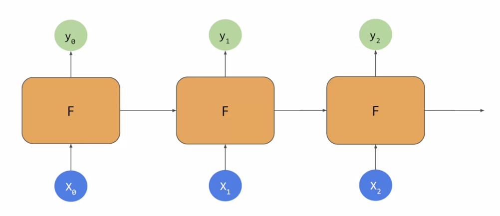
Ảnh hưởng của các giá trị trước có thể bị quên đi sau một vài time steps. Lý thuyết có thể nhớ được nhưng thực thế rất dễ xảy ra vanishing gradient do đó các giá trị.

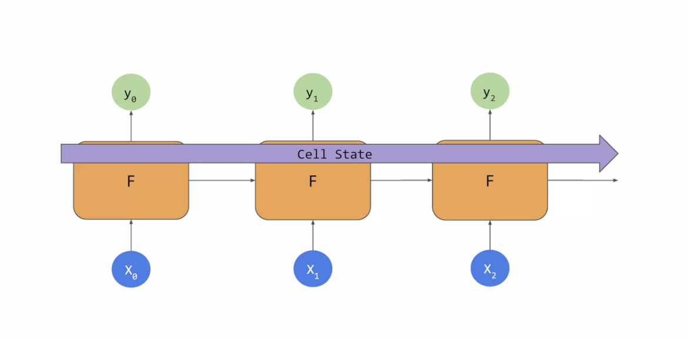

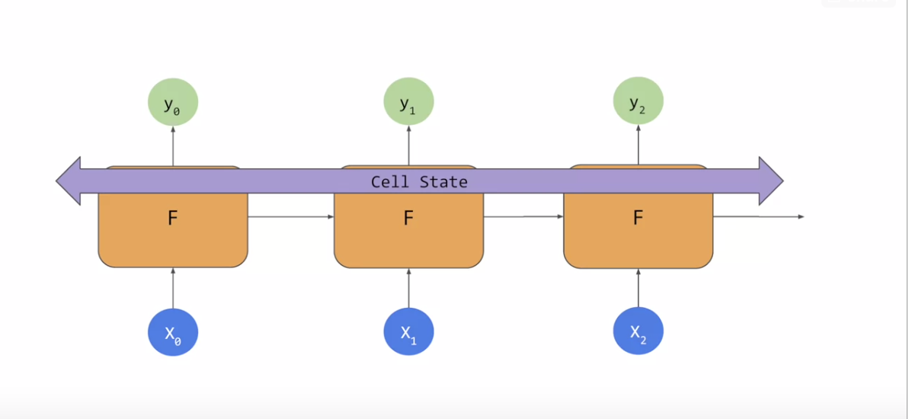

# Tài liệu tham khảo
https://en.wikipedia.org/wiki/Huber_loss


